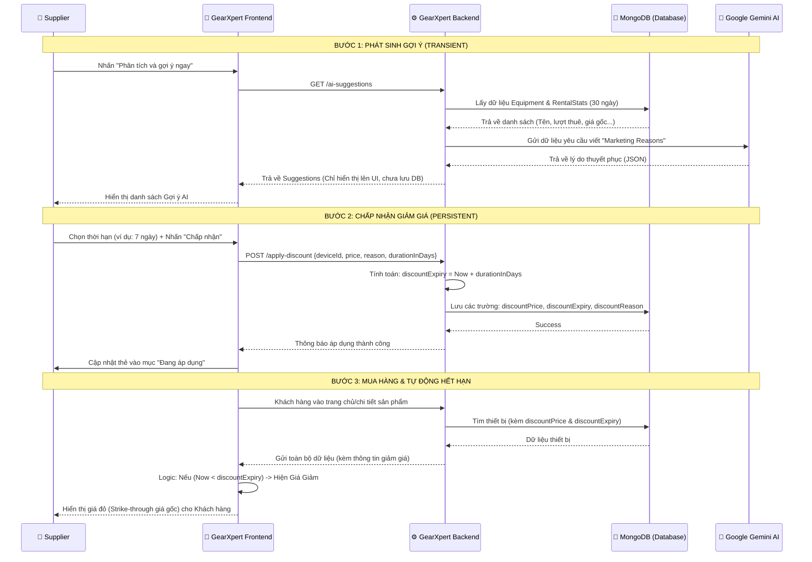

# 🚀 Hướng Dẫn Luồng Hoạt Động: AI Dynamic Pricing (SmartPrice)

Tài liệu này giải thích cách thức hoạt động của hệ thống đề xuất giá thông minh bằng AI, từ lúc phát sinh gợi ý đến khi tự động hết hạn giảm giá.

---

## 🏗️ 1. Sơ đồ trình tự (Sequence Diagram)

Sơ đồ dưới đây mô tả sự tương tác giữa **Supplier**, **Frontend (FE)**, **Backend (BE)**, **Database (DB)** và **Gemini AI**.



---

## 📦 2. Cách thức Truyền xuất Dữ liệu (Data Definition)

Hệ thống sử dụng các trường dữ liệu quan trọng trong Model [Device](file:///d:/GearXpert/GearXpert/gearxpertbe/controllers/Device/DeviceController.js#129-208):

| Trường (Field) | Loại (Type) | Ý nghĩa |
| :--- | :--- | :--- |
| `rentPrice.perDay` | `Number` | **Giá gốc cố định** của sản phẩm (không bao giờ thay đổi bởi AI). |
| `discountPrice` | `Number` | **Giá ưu đãi** mà Supplier chấp nhận. Nếu `= 0`, coi như không giảm giá. |
| `discountExpiry` | [Date](file:///d:/GearXpert/GearXpert/gearxpertfe/src/pages/Supplier/SupplierRentalRequests.js#60-68) | **Ngày hết hạn**. Database lưu giá trị tuyệt đối (ví dụ: `2024-04-01`). |
| `discountReason` | `String` | Lời khuyên của AI được Supplier lưu lại để thu hút khách thuê. |

---

## 🛠️ 3. Quy trình Xử lý Logic

### A. Giai đoạn Gợi ý (Transient Stage)
- **Đặc điểm:** Không lưu vào Database để tránh "rác" dữ liệu.
- **Xử lý:**
  1. **Lọc dữ liệu (Lấy tối đa 5 sản phẩm):** Hệ thống ưu tiên quét các thiết bị có hiệu suất thuê kém nhất (lượt thuê < 5 trong 30 ngày qua).
  2. **Chiến lược tính % Giảm Giá:** Mức giảm được tự động nội suy dựa trên số lượt thuê thực tế nhằm tối ưu hóa vòng quay vốn:
     - Lượt thuê = **0**: Gợi ý giảm mạnh **15%** (Chiến thuật "Phá Băng" hàng tồn).
     - Lượt thuê **1 đến 2**: Gợi ý giảm **12%** (Chiến thuật "Cú hích" leo Top).
     - Lượt thuê **≥ 3**: Gợi ý giảm mỏng **10%** (Tăng sức cạnh tranh).
  3. **AI Phân Tích & Viết Content:** Sau khi ra mức giá, dữ liệu gửi sang Gemini AI để phân tích đặc thù ngành hàng (Camera, Lens, Audio...) và tự động sinh ra "Lý do tiếp thị" dưới góc độ chuyên gia tài chính.
  4. **Tính chất dữ liệu:** Các gợi ý này chỉ "sống" trên UI phiên làm việc hiện tại, hoàn toàn không lưu vào Database trừ khi Supplier ấn Chấp nhận.

### B. Giai đoạn Áp dụng (Persistent Stage)
- **Chuyển đổi thời gian:** Khi Supplier chọn "7 ngày", Backend sẽ dùng `new Date()` cộng thêm 7 ngày để ra thời điểm hết hạn chính xác.
- **Ghi đè:** Nếu sản phẩm đang có giá giảm cũ, việc áp dụng gợi ý mới từ AI sẽ ghi đè hoàn toàn thông tin cũ.

### C. Giai đoạn Hiển thị (Display Logic)
Tại giao diện User ([ProductCard.js](file:///d:/GearXpert/GearXpert/gearxpertfe/src/components/common/ProductCard.js) & [ProductDetailPage.js](file:///d:/GearXpert/GearXpert/gearxpertfe/src/pages/Device/ProductDetailPage.js)), chúng ta xử lý như sau (giả mã):
```javascript
const priceToDisplay = (discountPrice > 0 && Now < discountExpiry) 
                       ? discountPrice 
                       : originalPrice;
```
👉 Điều này đảm bảo:
1. Giá giảm chỉ hiện khi còn hạn.
2. Ngay giây phút hết hạn, giá gốc sẽ tự động "quay trở lại" mà không cần Server phải chạy job dọn dẹp nặng nề.

### D. Giai đoạn Hủy bỏ (Manual Revoke)
- Supplier có thể nhấn **"Hủy giảm giá"** bất cứ lúc nào. Khi đó:
    - `discountPrice` về `0`.
    - `discountExpiry` về `null`.
    - Sản phẩm lập tức trở về giá gốc trên toàn hệ thống.

---

> [!TIP]
> **Lời khuyên vận hành:** 
> Hãy khuyến khích Supplier sử dụng các kỳ hạn ngắn (3-7 ngày) để tạo hiệu ứng "Flash Sale", điều này kích thích tâm lý khách hàng thuê thiết bị nhanh hơn rất nhiều so với giảm giá vĩnh viễn.
