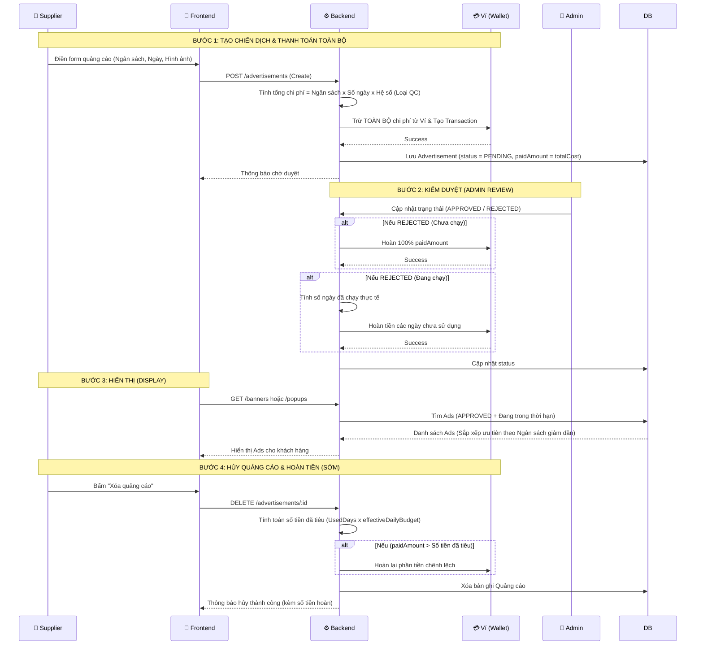

# 📢 Hướng Dẫn Luồng Hoạt Động: Hệ Thống Quảng Cáo (Advertisements)

Tài liệu này giải thích chi tiết cách thức hoạt động của hệ thống chạy quảng cáo (Banner & Popup) trên GearXpert, đặc biệt là các luồng tài chính (trừ tiền/hoàn tiền) liên quan đến Ví (Wallet).

---

## 🏗️ 1. Sơ đồ trình tự (Sequence Diagram)

---

## 📦 2. Cách thức Truyền xuất Dữ liệu (Data Definition)

Các trường dữ liệu quan trọng trong Model `Advertisement`:

| Trường (Field) | Loại (Type) | Ý nghĩa & Logic |
| :--- | :--- | :--- |
| `adsType` | `Array` | Loại quảng cáo: `BANNER`, `POPUP` hoặc cả hai. **(Lưu ý: Nếu chọn cả 2, chi phí nhân đôi).** |
| `dailyBudget` | `Number` | Ngân sách ngày. **Tối thiểu: 10.000 VNĐ/ngày.** |
| `totalCost` | `Number` | Tổng chi phí dự kiến cho toàn bộ chiến dịch. |
| `paidAmount` | `Number` | Số tiền Supplier thực tế **đã bị trừ khỏi ví** lúc tạo đơn (= `totalCost`, thu toàn bộ trước). |
| `status` | `String` | Trạng thái: `PENDING` (Chờ duyệt), `APPROVED` (Đang chạy), `REJECTED` (Bị từ chối), `EXPIRED` (Hết hạn). |

---

## 🛠️ 3. Quy trình Xử lý Logic & Tài Chính

### A. Logic Tính Phí & Thu Tiền (Thanh toán toàn bộ trước)
- **Chi phí thực tế (Effective Budget):** Nếu Supplier chọn cả 2 loại `[BANNER, POPUP]`, ngân sách ngày sẽ bị **nhân 2**.
- **Tính tổng ngày (DiffDays):** Tính cả ngày bắt đầu và ngày kết thúc (`End - Start + 1`).
- **Thu toàn bộ chi phí:** Khi tạo Ads, Backend thu **100% `totalCost`** ngay lập tức từ Ví. Điều này đảm bảo không xảy ra thất thoát doanh thu.
  👉 Ví dụ: Chạy 30 ngày, ngân sách 10k/ngày (Tổng = 300k). BE sẽ trừ luôn `300.000đ` từ Ví (`paidAmount = 300k`).
- **Ví không đủ tiền:** Trả về mã lỗi HTTP 400 (Custom `errorCode: 2`), thông báo cho Supplier đi nạp thêm tiền.
- **Chính sách hoàn tiền:** Nếu Supplier hủy sớm, hệ thống sẽ **tự động tính số ngày đã chạy** và hoàn lại tiền cho các ngày chưa sử dụng.

### B. Logic Kiểm Duyệt & Từ chối (Refund)
- Nếu Admin chọn **APPROVED**: Quảng cáo sẽ nằm chờ đến đúng `startDate` để tự động lên sóng.
- Nếu Admin chọn **REJECTED**:
  - **Đang `PENDING` hoặc chưa tới `startDate`:** Hoàn **100%** `paidAmount`.
  - **Đang `APPROVED` và đã chạy:** Tính số ngày thực tế đã chạy (`UsedDays`), tính chi phí đã tiêu (`CostOfUsedDays = UsedDays × effectiveDailyBudget`), hoàn lại phần tiền dư (`paidAmount - CostOfUsedDays`).

### C. Logic Hiển thị (Thuật toán Rank Quảng Cáo)
Tại API `getApprovedBanners` & `getApprovedPopups`:
1. Lọc theo trạng thái: Bắt buộc `status = 'APPROVED'`.
2. Lọc theo thời gian: Phải khớp `startDate <= Now <= endDate`.
3. **Sắp xếp ưu tiên (Ranking):** Sắp xếp theo **`dailyBudget` giảm dần**. Điều này tạo ra một hệ thống đấu giá ngầm: **Ai chi nhiều tiền / ngày hơn sẽ được ưu tiên hiển thị trước.**

### D. Logic Hủy Sớm (Xóa Quảng Cáo) & Công thức Hoàn Tiền
Supplier có thể tự hủy quảng cáo bất cứ lúc nào. Khi đó, thuật toán **hoàn tiền** hoạt động như sau:
1. Nếu đang `PENDING` hoặc **Chưa tới ngày bắt đầu**: Hoàn 100% `paidAmount`.
2. Nếu **Đang chạy**: 
   - `UsedDays = floor((Now - StartDate) / 1 ngày) + 1`
   - `CostOfUsedDays = UsedDays × effectiveDailyBudget`
   - `RefundAmount = paidAmount - CostOfUsedDays`
   - Nếu `RefundAmount > 0`: Hoàn lại phần tiền dư.
   - Nếu `RefundAmount <= 0`: **Không hoàn tiền.** (Đã chạy hết ngân sách).
   
   👉 **Ví dụ thực tế:** Đăng quảng cáo 30 ngày, ngân sách 10k/ngày (tổng = 300k). Hủy vào ngày thứ 29:
   - `UsedDays = 29`, `CostOfUsedDays = 29 × 10.000 = 290.000đ`
   - `RefundAmount = 300.000 - 290.000 = 10.000đ` → Hoàn lại **10.000đ** (1 ngày chưa dùng).
