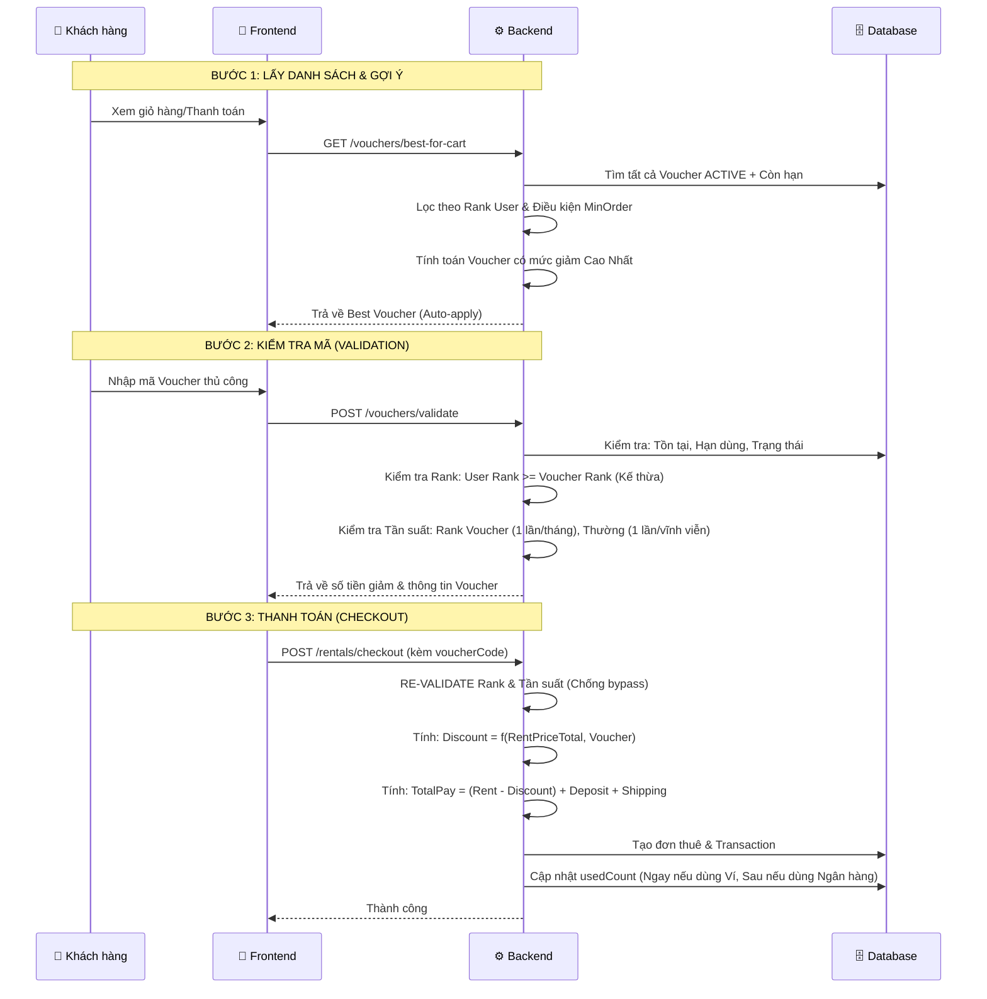

# 🎫 Hướng Dẫn Luồng Hoạt Động: Hệ Thống Mã Giảm Giá (Vouchers)

Tài liệu này giải thích chi tiết cách thức hoạt động của hệ thống Voucher trên GearXpert, bao gồm các loại voucher, điều kiện áp dụng và cách tính toán chiết khấu trong đơn hàng.

---

## 🏗️ 1. Sơ đồ trình tự (Sequence Diagram)

---

## 📦 2. Phân loại Voucher (Voucher Types)

Hệ thống hỗ trợ 2 nhóm Voucher chính:

| Tiêu chí | GLOBAL (Hệ thống) | SUPPLIER (Cửa hàng) |
| :--- | :--- | :--- |
| **Người tạo** | Admin | Chủ cửa hàng (Supplier) |
| **Phạm vi** | Áp dụng cho toàn bộ thiết bị trong giỏ | Chỉ áp dụng cho thiết bị của Shop đó |
| **Mục đích** | Chiến dịch Marketing toàn sàn | Shop tự khuyến mãi để hút khách |
| **Chiết khấu** | Giảm trực tiếp vào tổng tiền thuê | Giảm vào phần tiền thuê của Shop đó |

**Hình thức giảm giá:**
- `PERCENT`: Giảm theo % (có kèm `maxDiscount` để chặn mức giảm tối đa).
- `FIXED`: Giảm một số tiền cố định (VNĐ).

---

## 🛠️ 3. Quy trình Xử lý Logic & Điều kiện

### A. Logic Kế thừa Hạng (Rank Inheritance)
Voucher có thể thiết lập `applicableRank`. Người dùng có hạng cao hơn hoặc bằng hạng yêu cầu mới được sử dụng:
- Thứ tự: **BRONZE (1) < SILVER (2) < GOLD (3) < PLATINUM (4) < DIAMOND (5)**.
- *Ví dụ:* User hạng **GOLD** có thể dùng được Voucher của hạng GOLD, SILVER và BRONZE.
- **Bảo mật:** Logic này được kiểm tra ở cả API Validate (để hiện UI) và API Checkout (để chốt đơn), đảm bảo không thể hack rank.

### B. Tần suất Sử dụng (Usage Frequency)
- **Voucher thường:** Mỗi người dùng chỉ được sử dụng mã đó **1 lần duy nhất** (trừ khi đơn bị Hủy/Từ chối).
- **Voucher Rank (Đặc quyền hạng):** Mỗi tháng người dùng được sử dụng mã đặc quyền của hạng mình **1 lần**. Hệ thống tự động reset quyền lợi vào ngày 1 hàng tháng.

### C. Công thức Tính toán Tài chính
Khi áp dụng Voucher, các thông số trong đơn thuê (`Rental`) được tính như sau:
1. `rentPriceTotal`: Tổng tiền thuê gốc.
2. `voucherDiscount`: Số tiền được giảm.
3. `rentAfterDiscount = rentPriceTotal - voucherDiscount`.
4. `platformFee = rentAfterDiscount × 10%`. (Phí sàn tính trên tiền thuê sau giảm).
5. `supplierReceive = rentAfterDiscount - platformFee`.
6. `totalCustomerPay = rentAfterDiscount + depositAmount + deliveryFee`.

---

## ✅ 4. Các điểm lưu ý về Tính Chính Xác (Audit & Integrity)

Hệ thống đã được tối ưu để đảm bảo tính chính xác tuyệt đối về số liệu:

1.  **Cập nhật `usedCount` đồng bộ:**
    - **Thanh toán Ví:** Lượt dùng Voucher được trừ ngay lập tức trong Transaction của Checkout.
    - **Thanh toán Ngân hàng (PayOS):** Lượt dùng được trừ tự động thông qua Webhook ngay khi tiền về tài khoản. Đảm bảo mã không bị dùng "chùa" khi thanh toán lỗi.
2.  **Xử lý đơn hàng nhóm:**
    - Khi một giỏ hàng thanh toán cùng lúc cho nhiều Shop (tạo ra nhiều Đơn thuê), mã Voucher chỉ bị tính là **1 lần sử dụng**, tránh lãng phí lượt dùng của người dùng.
3.  **Chống Bypass (Double Validation):**
    - Toàn bộ điều kiện về Rank và Thời gian reset được kiểm tra tại lớp xử lý cuối cùng (Backend) để ngăn chặn các cuộc tấn công qua công cụ bên thứ 3.
